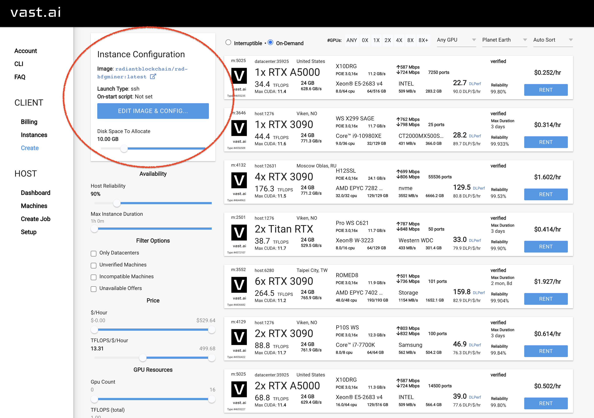
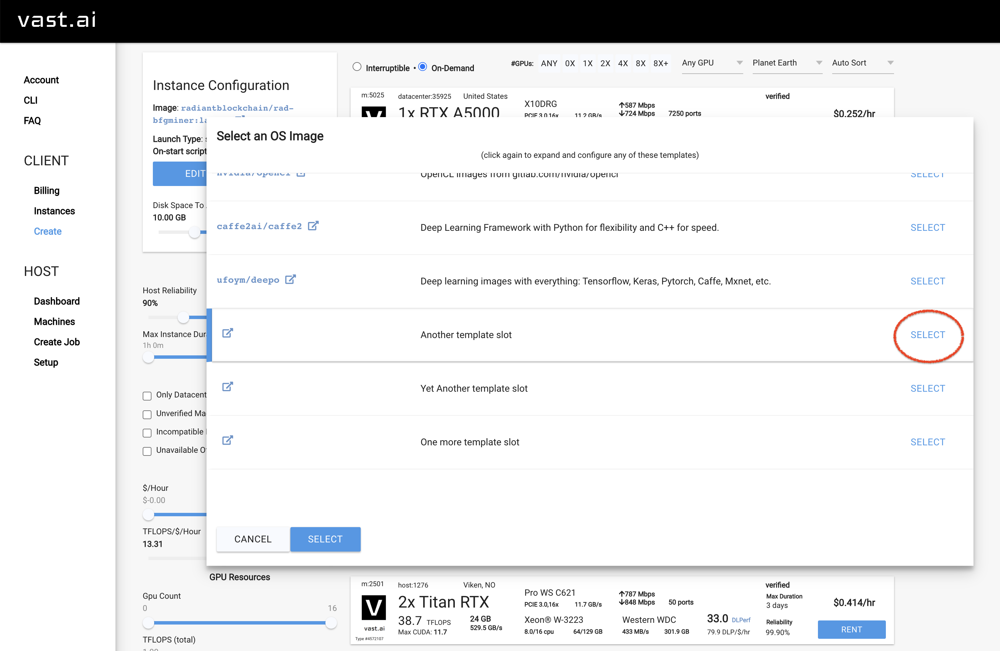
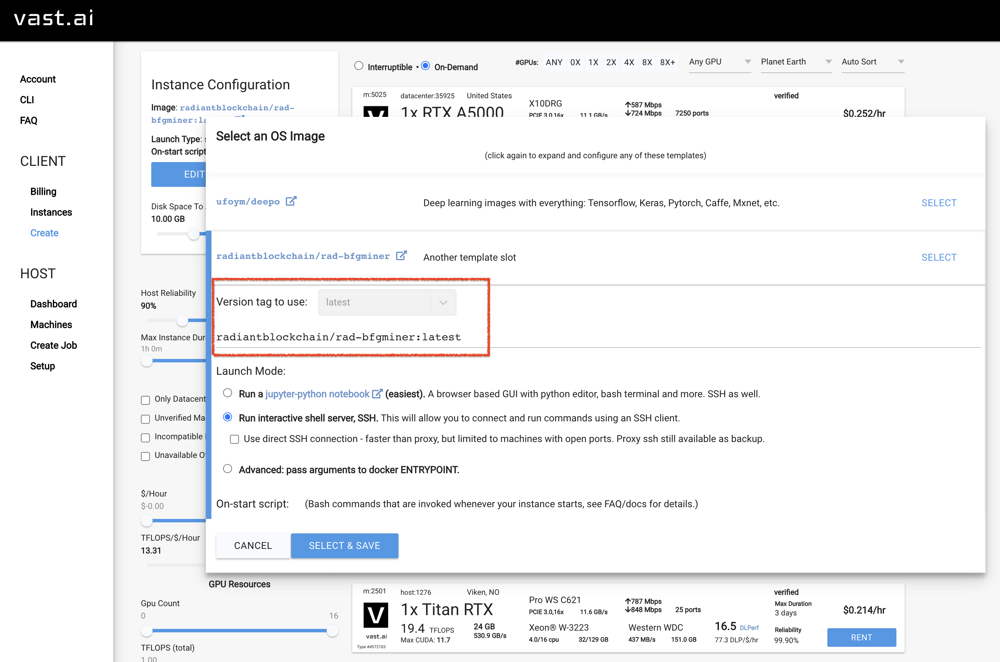
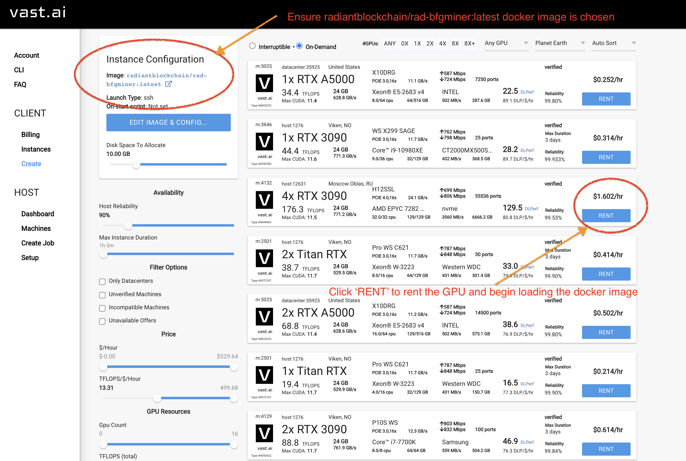
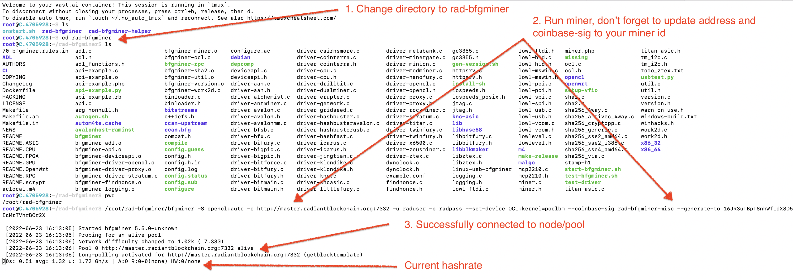
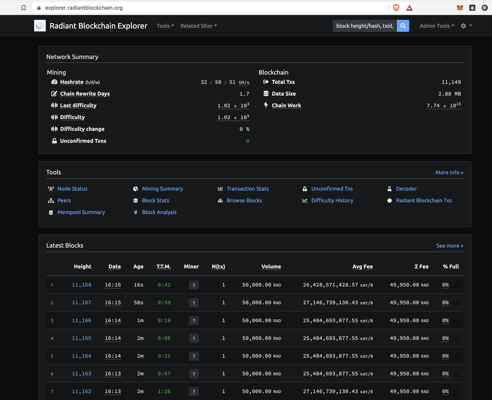

# Mining Radiant (RAD) Guide

The purpose of this guide is to provide instructions on how to GPU mine Radiant (RAD) Blockchain.

Setting up a node is out of scope of this guide, instead a sample URL is provided.

## Requirements

- Bitcoin/Radiant wallet address and private keys (ex: https://bitaddress.org - use at own risk!)
- Vast.ai account; or
- Computer with OpenCL/CUDA 11.2+ compatible GPU

## Mining with vast.ai

### Step 1. Create an account at vast.ai

Login and add some credit to your account. Most miners we are using cost between $0.20 to $0.35 per hour (ex: RTX 3090)

### Step 2. Specify and Load Prebuilt Docker Image

The latest prebuilt docker image can be pulled from https://hub.docker.com/repository/docker/radiantblockchain/rad-bfgminer

Follow the instructions in vast.ai to specify the image `radiantblockchain/rad-bfgminer:latest`

Select 'Edit Image & Configure':



Select a template slot:



Specify `radiantblockchain/rad-bfgminer:latest` as the docker image to pull. Make sure to select `Run interactive shell server. SSH`. Once
finished press 'Select'. Now the docker image is prepared in your configuration to choose a GPU system to rent.



Please note: at the time of writing there is a bug in the vast.ai user interface that prevents removing the `null:` tag. Type something into
the text box and then enter the full `radiantblockchain/rad-bfgminer:latest` and then remove any excess characters at the beginning.

Select 'Rent' for a GPU to begin loading the image



### Step 3. SSH/Powershell into the server

Navigate to the 'Instances' tab in the UI and once the docker image is loaded (after about 2 to 5 minutes) you will see a 'Connect' button.


The SSH connect command is displayed. Please note, you may need to create a local SSH key first and it will prompt you to specify one.

Use the following guide to create one: https://docs.github.com/en/authentication/connecting-to-github-with-ssh/generating-a-new-ssh-key-and-adding-it-to-the-ssh-agent

After that key is provided, now you can securely connect via SSH to the vast.ai host:


After that key is provided, now you can securely connect via SSH to the vast.ai host. Once connected, proceed to the next step below.

### Step 4. Run RAD-BFGMINER



Navigate to the `rad-bfgminer` directory and execute the following command. *Please note* you MUST specify your own `--generate-to` address (Ex: https://bitaddress.org for example, use at own risk) in the command below:


```
cd rad-bfgminer
```

Run the miner with all options to enable GPU, URL endpoint to an existing node (Ex: `master.radiantblockchain.org:7332` can be replaced with your own node URL if you wish or leave it as is)

```
/root/rad-bfgminer/bfgminer -S opencl:auto -o http://master.radiantblockchain.org:7332 -u raduser -p radpass --set-device OCL:kernel=poclbm --coinbase-sig hello-miner --generate-to 16JR3uTBpTSnhWfLdX8D5EcMrTVhrBCr2X 
```
EX: replace `16JR3uTBpTSnhWfLdX8D5EcMrTVhrBCr2X` with your public address and replace `hello-miner` with your miner id (keep it short, no spaces allowed)

### Step 5. Browse Radiant Blockchain

You can use the public blockchain explorer at https://explorer.radiantblockchain.org to browse existing blocks and find your address to see which blocks you mined.



Clicking on any block will bring up details about that block, transactions included and the miner information.


Show details for an address by clicking on the coinbase output address to see balances and activity for the address.


## Mining with owned system

To mine Radiant (RAD) with a non-hosted system, simply follow the build instructions the normal way to build bfgminer.

It may be helpful to consult the Dockerfile for more examples

Clone and build the repo (tested on Ubuntu 18.04 and Ubuntu 20.04). Expected to work on all supported OS.

```
git clone https://github.com/radiantblockchain/rad-bfgminer.git
cd rad-bfgminer
# Replace the github paths or the ./autogen.sh script fails since it checks out git submodules that can hang socket timeout
git config --global url.https://github.com/.insteadOf git://github.com/
./autogen.sh
./configure --enable-opencl
make
```

Single GPU example:

```
./bfgminer -S opencl:auto -o http://master.radiantblockchain.org:7332 -u raduser -p radpass --set-device OCL:kernel=poclbm --coinbase-sig rad-bfgminer-misc --generate-to 16JR3uTBpTSnhWfLdX8D5EcMrTVhrBCr2X 

./bfgminer -S opencl:auto -o http://master.radiantblockchain.org:7332 -u raduser -p radpass --set-device OCL:kernel=poclbm --coinbase-sig rad-bfgminer-misc --generate-to 16JR3uTBpTSnhWfLdX8D5EcMrTVhrBCr2X 
```

4x GPU example:

```
./bfgminer -S opencl:auto -o http://master.radiantblockchain.org:7332 -u raduser -p radpass --set-device OCL0:kernel=poclbm --set-device OCL1:kernel=poclbm --set-device OCL2:kernel=poclbm --set-device OCL3:kernel=poclbm --coinbase-sig rad-bfgminer-misc --generate-to 16JR3uTBpTSnhWfLdX8D5EcMrTVhrBCr2X
```

*Note*: Ensure you replace `rad-bfgminer-misc` with your miner id and also the `--generate-to` address to the public address you generated with bitaddress.org (Use at your own risk!)
 